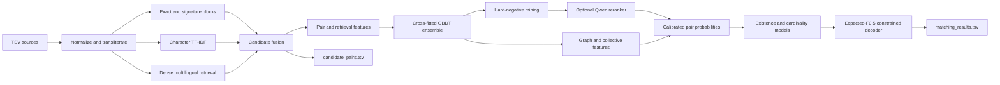

# Amazon ML entity resolution

A reproducible multilingual entity-resolution pipeline for linking Source-1 businesses to
zero or more Source-2/Source-3 records. It combines high-recall lexical and dense retrieval,
structured pair features, cross-fitted gradient-boosted ensembles, optional Qwen reranking,
graph evidence, probability calibration, and a decoder optimized for entity-level macro F0.5.

The repository includes a fully runnable CPU baseline and modular advanced stages. Raw
competition data, model weights, caches and submissions are intentionally excluded.

## Architecture



See [architecture.md](docs/architecture.md) for stage contracts and design decisions.
See [cloud_gpu.md](docs/cloud_gpu.md) for Colab, SageMaker, and EC2 setup.

## Quick start

Use Python 3.11 or 3.12. Python 3.13 is intentionally excluded because the GPU stack is not
consistently supported across PyTorch, FAISS and bitsandbytes releases.

```bash
git clone https://github.com/your-org/amazon-ml-entity-resolution.git
cd amazon-ml-entity-resolution
python -m venv .venv
source .venv/bin/activate
python -m pip install --upgrade pip
python -m pip install -e ".[dev]"
python -m pytest
amazon-er smoke --config configs/smoke.yaml
```

Install GPU components only on a CUDA machine:

```bash
python -m pip install -e ".[dev,gpu]"
amazon-er doctor --config configs/a100.yaml
```

Expected private data layout:

```text
dataset/
  train/
    train_source1.tsv
    train_source2.tsv
    train_source3.tsv
    train_ground_truth.tsv
  test/
    test_source1.tsv
    test_source2.tsv
    test_source3.tsv
```

Run the audited CPU baseline:

```bash
amazon-er baseline audit --config configs/baseline.yaml
amazon-er baseline train --config configs/baseline.yaml --ood --ablations
amazon-er baseline train-full --config configs/baseline.yaml
amazon-er baseline predict --config configs/baseline.yaml
```

Run the modular advanced stages:

```bash
bash scripts/run_cpu_pipeline.sh configs/production.yaml dataset artifacts output
```

That script executes raw TSV preparation, train/test retrieval, feature building, grouped model
training, all-data scoring, decoding, both output files, and format validation. Each command is
also available separately; run `amazon-er --help` and `amazon-er <command> --help` for its exact
contract. On an A100/Linux machine, first run `bash scripts/bootstrap_a100.sh`, then use
`configs/a100.yaml` to enable Qwen3 dense retrieval. Reranker scoring and LoRA training remain
optional APIs because they are useful only after measuring hard-negative and ambiguous-pair
coverage.

The smoke workflow writes an atomic manifest containing its configuration hash, environment,
elapsed time, output fingerprints, and failure state. The full workflow uses explicit stage
directories so completed Parquet/model outputs can be copied to durable storage independently.

## What is implemented

- Streaming TSV ingestion, audit and official-format submission writing.
- Unicode-preserving normalization, script detection and optional transliteration variants.
- Exact/signature blocking plus sparse and dense candidate interfaces.
- Reciprocal-rank candidate fusion with per-source caps and provenance.
- Pair features, LightGBM training, grouped folds and all-fold refits.
- Hard-negative mining from high-score false pairs and target conflicts.
- Optional Qwen yes/no reranking with adaptive CUDA batch size.
- Collective graph features and deterministic target exclusivity.
- Platt/isotonic calibration, match-existence and match-count features.
- Threshold, expected-F0.5 and probability-aware decoding.
- Country/script/cardinality evaluation and concrete error tables.
- Atomic checkpoints and content-addressed run manifests.

## Validation rules

Entity folds are assigned by a stable hash of Source-1 IDs. Pair-random splits are prohibited.
Candidate recall is measured before model training, and all final model comparisons use OOF
predictions. Hyperparameters and decoding rules are selected on OOF/calibration data; untouched
holdout results are reported once. The public leaderboard is not treated as a tuning set.

## Models and data

The base installation does not download pretrained models. Dense retrieval and reranking are
optional extras configured by model ID and immutable revision. Review each model license and the
competition rules before use. Never commit raw data, Hugging Face tokens, AWS credentials,
embeddings or output files.

## Repository map

```text
configs/                 reproducible smoke/CPU/A100 configurations
docs/                    architecture, data contracts and experiment protocol
src/amazon_er/           production package
  candidates/            transliteration, sparse/dense retrieval and fusion
  models/                ensembles, hard negatives, calibration and reranking
  graph/                 collective features and exclusivity
  decision/              expected-F0.5 and final decoding
  evaluation/            grouped splits, slices and experiment records
tests/                   fast deterministic unit tests
tools/validate_submission.py
```

## License

Project code is MIT licensed. Dependencies and model weights retain their own licenses.
